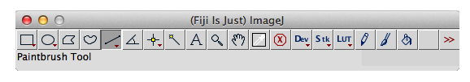
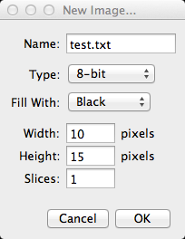
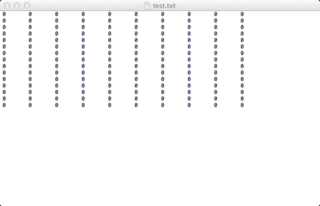
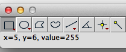
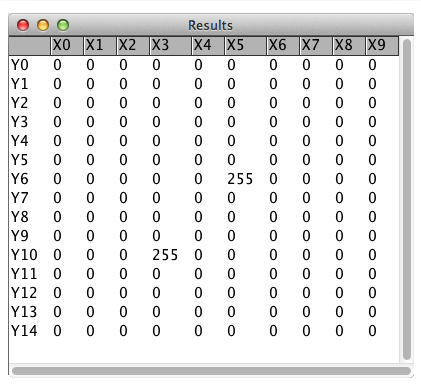
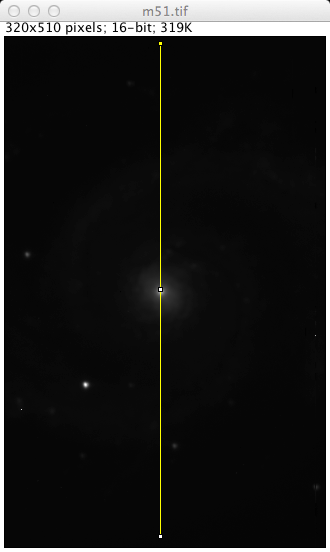
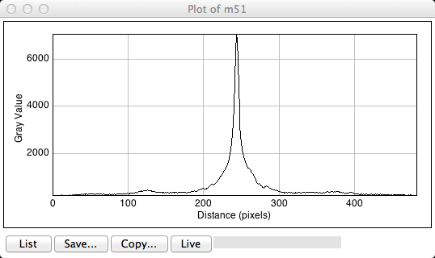
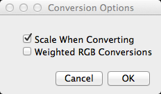
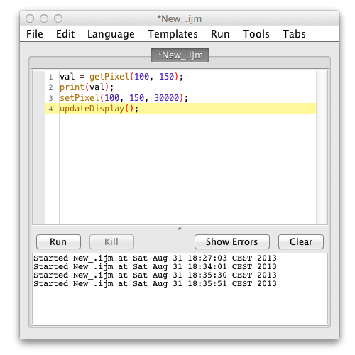
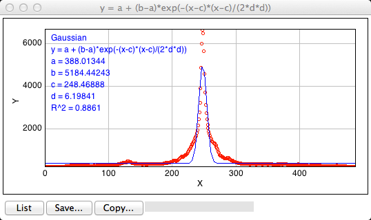

#ImageJ定量階梯　第1回

監修：塚田祐基、三浦耕太

第一回担当：三浦耕太（欧州分子生物学研究所）

## はじめに

生物システムのダイナミクスを捉えるライブイメージングは、研究の最前線にさまざまな新しいアプローチを提供している。イメージング自体はロバート・フックが17世紀に複式顕微鏡を発見してから連綿と発展を遂げてきた技術といえるが、それが計算機と融合することで質的な転換が起きた。多次元画像の可視化・解析、時系列の遡行、“よく撹拌”されていない生化学とモデリング、超解像度解析による一分子の分布の可視化、画像データの取得・解析の大規模化と自動化などが新しいアプローチとして挙げられるであろう。こうしたことで例えばアクチンフィラメントの動態や、ゼブラフィッシュの細胞レベルでの網羅的発生ダイナミクスなど、動的なシステムに迫る生物学がまさに今、精力的に進められている[1]。こうしためざましい発展がある一方で、画像解析そのものに敷居の高さを感じているという生物研究者をよく見かけるようになった。

これはおそらく次のような理由ではないか。画像処理は計算科学の一部として確固たる地位を占める分野である。一方生物学における画像解析、すなわち測定技術としてのそれはいまだに体系化されておらず、どのように学べばよいのかがわかりにくい。そこで本連載ではこうした生物学の需要を踏まえた上で、生物画像の定量解析を読者が自ら学ぶための記事を提供しようと考えている。

[1] Danuser G. (2011) Computer vision in cell biology. Cell, 147(5):973-8. PMID: 22118455

## ImageJと画像処理・解析

この連載ではImageJ(Fiji)を使って画像解析の方法を紹介していく。ImageJは科学的な画像解析のためのソフトである。NIHにいたWayne Rasbandが15年ほどまえに開発を始め、オープンソースであることから多くの研究者が開発に参入していった[2]。今や生物学のイメージング分野ではデファクトスタンダードとなっており、Fijiなどのディストリビューションを生み出しながらいまでもその開発が続いている。

ImageJのバージョン1.48b（2013年8月25日付リリース）にはメニューの項目が505もある。その多岐にわたる機能を十分に使いこなしている人は少ないだろう。これらの機能を駆使できるようになるには、手順を覚えるだけでは困難であり、画像処理・解析の原理をある程度まで知っている必要がある。したがってこれらの基礎的な面について解説しながら徐々に高度な処理を行えるように展開してゆくつもりである。今しばらくは生物学的に興味のある内容ではないのでこの点ご容赦願いたい。また、高度な解析にはどうしてもある程度のプログラミングが必要になる。毎回短いスクリプトも紹介するので、それぞれの目的にあった解析に応用していただきたい。

[2] Schneider, C. A., Rasband, W. S., & Eliceiri, K. W. (2012). NIH Image to ImageJ: 25 years of image analysis. Nature methods, 9(7), 671–5. PMID:22930834

## Fijiのインストール

読者は各自のパソコンにImageJのディストリビューションのひとつであるFijiをインストールしていることを想定している。もしインストールしていない場合は、以下のサイトからFijiをダウンロードしてインストールしてほしい。

<http://fiji.sc>

インストールの仕方がわからない、という方はこちらのページを参照に。

[Fijiのインストール手順]()（準備中）

Fijiのアイコンをクリックして図1のようなメニューバーが表示されれば、インストールは成功である。

図1　Fijiのメニューバー。

##テキストエディタを使った画像処理

デジタル画像データの真の姿は数字のマトリクスである。このことを実感してみよう。まず新しい画像を作成し、そのマトリクスをテキストエディタで編集し、再びそれを画像に戻してみることにする。この演習はテキストエディタで画像処理を行うことに相当する。

**演習　1**：まず新しい画像を作成する。Fijiのメニューから[File > New > Image…]を選択すると、入力ウィンドウが表示される（図2）。次のようにパラメータを入力し、OKのボタンをクリックする。

* Name: test.txt
* Type: 8-bit
* Fill with: Black
* Width: 10
* Height: 15
* Slices: 1

図2　新しい画像を作成するときの入力ウィンドウ。

すると黒いバックグラウンドの画像が表示される。この画像はかなり小さいので、キーボードの＋を何度か叩いて拡大するとよい（逆に小さくする場合は−のキーを叩く）。この画像を[File > Save As > Text Image] によってデスクトップに保存する。ファイルの拡張子が.txtであることを確認し（OSの設定によってはファイルの拡張子が隠されていることがある。この場合はファイルの「情報」などで確認する）、そのファイルをダブルクリックするとテキストエディタでファイルが開かれる。スペースで区切られた碁盤目状の数字を確認できるだろう。このそれぞれの数字が1ピクセルごとの輝度に相当する。真っ黒な画像なので、数字はすべて0のはずである（図3）。

図3　テキストエディタ（OSXのデフォルトはTextEdit, WindowsではNotepad）で開いた画像。

さて、どれでもよいのでいくつかの0を255に書き換えてみよう。数字の間のスペースを削除しないように注意する。書き換えたらファイルをtest2.txtなどの別名でデスクトップに保存する。Fijiに戻って[File > Import > Text Image…]をメニューから選択し、先ほどテキストエディタで編集したファイルを開くように指定する。こうして開いた画像は、0を255に置き換えた場所が白い点になっているはずである。0が黒、255が白のピクセルとして表示されていることが実感できるだろう。

以上がテキストエディタを使った画像処理である。ImageJが行っている画像処理はすべてこのように画像の真の姿である数字のマトリクスに対して処理を行っている。

なお、開いている画像の特定の位置のピクセル輝度を知りたい場合には、その位置にマウスのポインタを置くと、メニューバーの左下の隅にその位置の座標と輝度が表示される（図4）。

図4　メニューバーに表示されるピクセルの値

ピクセル輝度をマトリクスとして表示したい場合には[Image > Transform > Image to Results]を実行すると、新たなウィンドウが開き、画像を数値として眺めることができる（図5）。ただし編集することはできない。

図5　ピクセル値を表に表示する

##画像のビット深度

上の演習ではテキストエディタで0を255に書き換えた。なぜ255であったのか。この疑問に答えるには、ビット深度について理解する必要がある。

それぞれの画像を構成するピクセルはある特定の値を持っている。グレースケールの画像であれば、この値は黒から白までの間のある特定の明るさに相当することになる。黒から白の間には無限の階調があるはずであるが、コンピュータ上では黒と白の間の濃淡を有限の数で分割してピクセルの値に対応させる（量子化という）。単純には黒と白の二つだけに分割する。これを2階調（Binary）と呼ぶ。この場合ピクセルの値は単に0か1かということで十分であり、二進数にして一桁（1ビット）で各ピクセルの値を指定できる（図6）。

白黒だけではなく中間の灰色を表示するためには階調を増やし、例えば4階調にする。こうすると薄い灰色と濃い灰色を白と黒の間に表示することができる。0から3までの4種類の値があればこれらの階調を指定することが可能であり、二進数では二桁の数で表現することができる。よってこれは2ビット画像になる。よりなめらかに明暗を表示するには階調をさらに増やす必要があり、このため最も頻繁に使われるのが256階調である。256を2進数で表現すると8桁の数字（\(2^8\)）となるので256階調の画像は8ビット画像である。

図6　ビット深度と階調数。

1ピクセルあたりに割り当てられているメモリの量をビット深度（bit depth）と呼ぶ。8ビット画像の場合ピクセルの値は0から255までの整数をとる。上の演習で255に置き換えたのは、それが8ビットの画像でとりうる最大の値だからである。16のビット深度を持つ画像は\(2^{16}\)すなわち65,336の階調を持つ。白と黒の間をより細かく分割するので量子化誤差が小さくなる。なお普通の人間が認識できる階調の精度は8ビット以下なので、8ビットと16ビットのグレースケール画像の見た目は変わらない。また、二倍のメモリを各ピクセルに割り当てることになるので、ファイルのサイズもおよそ二倍になる。

以上紹介したビット深度はいずれも正の整数をピクセルの値としてもつが、正負の実数をピクセル値として保持することができるのが、32ビット浮動小数点画像である。ImageJでは単に32-bitとして名前がつけられている。32桁の容量を整数と一対一対応させるのではなく、指数表現で対応させる。ひと桁を正負の符号に、あとの桁を8桁の指数部と23桁の仮数部にわけて実数を表現する。ピクセルの値に実数を持たせることができると、さまざまな利点がある。たとえば、割合画像法（ratio imaging）で行われるように画像間の割り算を行った場合、8ビットや16ビットの画像では計算結果の小数点以下は切り捨てられてしまうが、32ビット画像で計算すれば小数点以下の値を持つ結果を得ることができる。

**演習　2**：16ビット画像の8ビットへの変換

画像のビット深度の違いは、ビット深度を変換しようとしたときにそれを実感することができる。まずサンプルの画像を[File > Sample Images > M51 GALAXY (177k, 16-bits)]で開いてみよう（開くにはインターネットに接続している必要がある）。この画像は16ビット画像である。この画像を二種類の方法で8ビット画像に変換し、結果の違いを輝度プロファイルで比較する。輝度プロファイルはある選択した線に沿ったピクセルの値をプロットした曲線である。

輝度プロファイルは次のようにして取得する。Fijiのメニューバーから線選択（line selection tool）のアイコン（左端から4番目の斜めの線のアイコン）をクリックして選び、上で開いた画像の明るい部分を通るように黄色の直線を描く（図7）。始点と終点をクリックすれば直線が描かれるはずである。次にメニューから[Analyze > Plot Profile]を選ぶと、横軸が（距離）Distance、縦軸が輝度（Gray value）のプロットが表示されるはずである（図8）。

図7　m51.tifの画像に線選択ツールで線選択を行う。

図8　輝度プロファイルのプロット

次のようにして三種類の輝度プロファイルを得る。

 1. 変換せずに16ビット画像のまま輝度プロファイルをえる。

 2. メニューから[Image > Duplicate] を選んで画像を複製する。[Edit > Option > Conversion]を選び、"Scale when converting"をチェックする。次に複製した画像が一番上にある（アクティブな画像と呼ぶ）ことを確認し、[Image > Type > 8-bit]を選び、ビット深度を8ビット画像に変換する。[Edit > Selection > Restore Selection]を選ぶ。1で描いたのと同じ位置に黄色い線が現れるはずである。この状態で[Analyze > Plot Profil]を選ぶと、2つ目の輝度プロファイルが表示される。

 3. 元々の16ビットの画像をアクティベート（画像のウィンドウをクリックする）し、再び[Image > Duplicate] によって複製する。[Edit > Option > Conversion]を選び、"Scale when converting"のチェックを外す。あとは2と同じような方法で、これまでと同じ位置から輝度プロファイルを得る。これが3番目の輝度プロファイルである。
 
図9　正規化のオプションを変更するウィンドウ。この場合は"Scale When Converting"がチェックされているので正規化してビット深度の変換が行われる。

3つの輝度プロファイルを比較すると次のようなことがわかるだろう。まず1番目と2番目の輝度プロファイルの形が極めて似ていることである。とはいえ、縦軸の目盛を比較すると、レンジがことなっていることがわかる。3番目の輝度プロファイルは形がだいぶことなっている。"Scale when converting"は、変換の際に値を正規化するかどうかを決定するオプションである。最初の変換では値が8ビットの深度に正規化されるが、二番目の変換では正規化をしないように選択したことになる。正規化が行われない場合、16ビットの画像で256以上だった値はすべて255の値になる。画像を眺めると、正規化をしなかった変換の場合、画像の多くの部分がサチっているのがわかるだろう。

16ビットから8ビットへの変換は情報量を削減することになる。デフォルトの設定では正規化がオンになっているが、見た目だけで正規化が行われていることに気がつくのは難しいだろう。

この演習がおわったら、オプションの"Scale when converting"のチェックをオンにして、デフォルトの状態に戻しておくことをおすすめする。

##宿題1

1. 4ビット画像はいくつの階調を持つか？
2. 横幅100ピクセル、縦100ピクセルの8ビット画像のファイルサイズを推定せよ。推定の根拠も説明せよ。画像のフォーマットはbitmap（bmp）とする。

回答は次の連載で示す。

##スクリプトによるピクセル値へのアクセス

さて、ここからはImageJのマクロをつかって各ピクセルの値にアクセスする方法を解説する。次の二つの作業を試みる。（1）画像の特定のピクセル値を取得したり書き換えたりする。これは基礎中の基礎、といえるだろう。（2）演習2で行った輝度プロファイルの取得をマクロを使って行う。次にこのプロファイルにガウス分布のフィッティングを行い、輝点の中心座標を推定する。点光源のシグナルの位置を超解像度で推定するには、2次元ガウス分布のフィッティングがしばしばおこなわれる。このスクリプトはその1次元バージョンである。

なお、それぞれのコマンドの詳しい解説はImageJのサイトにある。そちらも参照にされたい。

<http://imagej.nih.gov/ij/developer/macro/functions.html>

プログラミングのそのものの基礎は誌面の都合上詳しく行うことはできないが、全く理解出来ない、という方は以下のリンクからダウンロードできる英語の教科書"Macro Programming in ImageJ"の2.2章と2.3章を自習することをお勧めする。

<http://cmci.embl.de/documents/ijcourses>

### 画像の特定のピクセル値を取得して書き換える

特定の座標のピクセル値を得るには関数``getPixel``を用い、ピクセル値を画像に書き込むには``setPixel``を用いる。画像m51.tifを再び開いてみよう（[File > Sample Images > M51 GALAXY (177k, 16-bits)]）。次にスクリプトエディタを[File > New > Script]によって開く。スクリプトエディタのメニューから、[Language > ImageJ Macro]を選んで言語を設定し、次の2行のコードを書く。

	val = getPixel(100, 150);
	print(val);

左下の"Run"というボタンをクリックするとスクリプトが実行される。Logウィンドウが開き、そこに"381"と表示されるはずである。これは、まず一行目で画像内の座標(100, 150)のピクセル値を変数valとして取得し、次にその変数の値をprintコマンドによってログウィンドウに出力している。このピクセルの値を書き換えるには、さらに次の2行を加える。

	setPixel(100, 150, 30000);
	updateDisplay();

図10 スクリプトエディタに4行のコードを書き終えたところ。

Runにより実行し、画像を確認すると、座標(100, 150)のピクセルが白い点になっていることがわかるだろう。ピクセル値が30000になっていることも、マウスのポインタをその位置に重ねて確認してみよう。

さらにループを使って横一文字の点線を引いてみる。スクリプトエディタで[File > New]を選んで新しいスクリプトを用意し、言語をふたたびImageJ Macroに設定する([Language > ImageJ Macro])。次の二行を書く。

	for (i = 0; i < getWidth(); i += 1){
		setPixel(i, 150, 30000);
	}

forループの条件に現れる``getWidth()``は、画像の横幅をピクセル数で取得するコマンドである。また、このコードでは使われていないが、縦の高さは``getHeight()``によって取得できる。画像の座標系は左上のコーナーが(0, 0)であり、右下の座標が(getWidth()-1, getHeight()-1)である。上記のコードのループは画像の右端のピクセルから左端のピクセルまでループし、`y = 150``にあるピクセルの値をすべて30000に書き換える。

###宿題2：スクリプト

上の例では水平の実線を描いた。垂直な点線を描くスクリプトを書いてみよ。

### 輝度プロファイルを取得し、ガウス分布をフィッティングする

画像m51.tifを再び開き（[File > Sample Images > M51 GALAXY (177k, 16-bits)]）、演習2で行ったように中央の明るい部分を通るline selectionを行う。この状態で以下のマクロを実行せよ。

	pf = getProfile();
	xs = newArray(pf.length);
	for (i = 0; i < xs.length; i += 1)
		xs[i] = i;
	Fit.doFit("Gaussian", xs, pf);
	Fit.plot;

一行目は関数``getProfile()``を使っている。この関数はアクティブな画像で選択されているline selectionに沿った輝度プロファイルを、ー次元の配列(Array)として返す。上のスクリプトではこの配列を変数pfとしている。なお、pfの要素の数はpf.lengthとすると取得できる。

フィッティングをするにはこのy軸の値だけではなくx軸の値も必要となるのでこれを用意するのが2行目から4行目までである。2行目では取得した輝度プロファイルと同じ長さの配列を``newArray``関数を使って配列xsとして用意する。初期値は0なので、3行目から4行目までのループで配列の要素の値をそれぞれ0,1,2,… xs.length-1と書きこむ。

5行目で関数``Fit.doFit``関数によってガウス分布のフィッティングを行い、6行目の``Fit.plot``によりその結果を表示する。

図11　ガウス分布をフィッティングした結果の表示例

##宿題の回答

###宿題1

問題：　4ビット画像はいくつの階調を持つか？

答え：　\(2^4\)階調、すなわち16階調である。

問題：　横幅100ピクセル、縦100ピクセルの8ビット画像のファイルサイズを推定せよ。推定の根拠も説明せよ。画像のフォーマットはbitmap（bmp）とする。

答え：　

1バイト＝8ビットなので
$$
100 \times 100 = 10,000 
$$
画像のファイルサイズは10,000バイトであると推定される。ただし、画像のフォーマットによってヘッダー部分の大きさが異なっている。bitmapの画像の場合は、次のようである。Fijiのメニューで[File > New…]を選び、Width = 100、Height=100の画像を新規に作成する。この画像を[File > SaveAs > BMP…]によりBMPファイルとして保存する。ファイルの大きさを確認すると、11,078バイトであることがわかる。BMPファイルは1,078バイトの大きさのヘッダー部分を持っていることがわかる。

なお、11,078バイトをキロバイトで表示する際には、通常とはことなり
$$
1Kbyte = 2^{10}byte = 1,024byte
$$
であることに留意する必要がある。11,078バイトはおよそ10.8キロバイトである。

###宿題2：スクリプト

問題：　上の例では水平の実線を描いた。垂直な点線を描くスクリプトを書いてみよ。

答え：　

画像の高さを取得する``getHeight``を使ってループを構成する。``setPixel``の引数のxを固定し、yをiによって移動させる。

	for (i = 0; i < getHeight(); i += 1){
		setPixel(158, i, 30000);
	}
	

