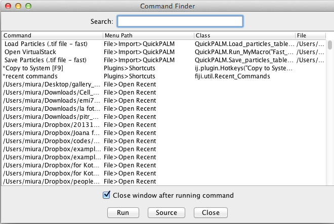
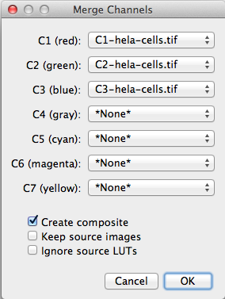
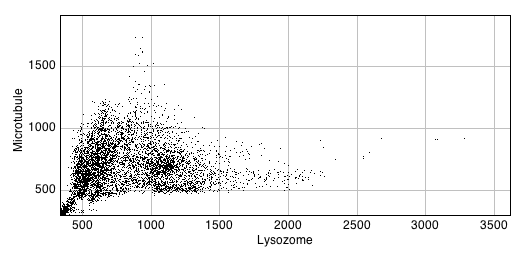
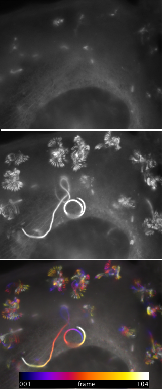
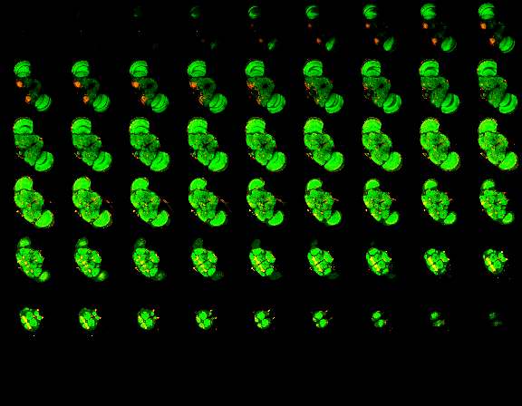
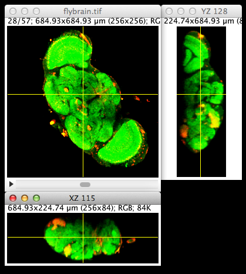
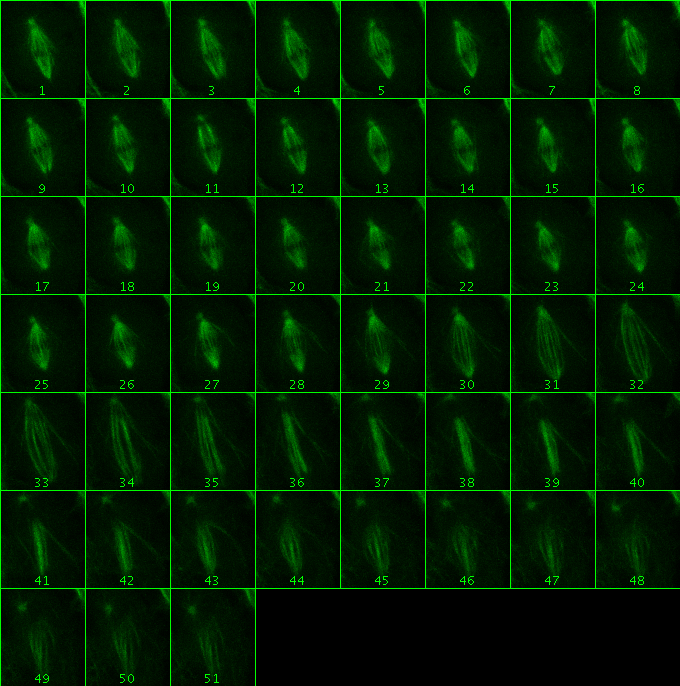
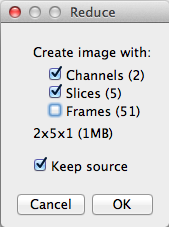
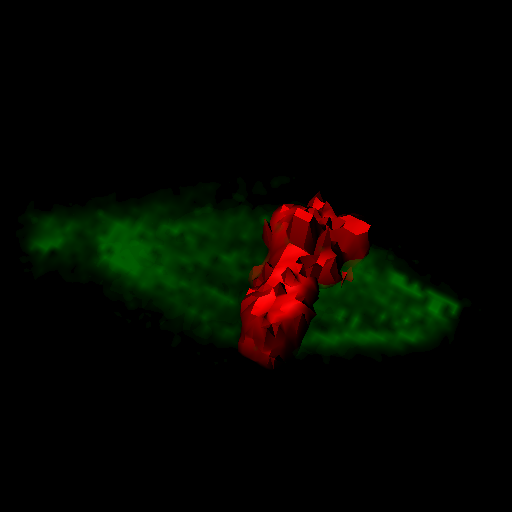

#ImageJ定量階梯　第3回　
多次元画像の可視化と取り扱い

第三回担当：三浦耕太

##生物学における多次元画像

普段わたしたちが目にしているデジタル画像のことを考えてみよう。いわゆる写真である。これらの画像は平面であり、二次元の情報である。特定の座標(x, y)ごとに、その位置に対応する輝度がひとつあることになる。動画を撮影した場合には、ご存知のように静止画像が順番に時系列で並んでいる。したがって動画はxy軸に加えて時間方向の次元（t軸）も持っていることになる。共焦点顕微鏡などで連続的な光学切片を取得した場合にも、その内実には二次元の画像が順番にならんでいる。ただし、この場合は深さ方向の次元（z軸）を持っている。異なる波長特性をもつ複数の蛍光プローブの画像をそれぞれ異なるチャネルで取得した場合には波長方向の次元を持って二次元画像が並ぶ。これはc軸と呼ぶことができるだろう。

このように、二次元空間xyの画像の複数がシリーズとなって3次元目のz、時間t、波長cの次元が加わるのが生物学における多次元画像の特徴である**。これらすべての次元を網羅する5次元画像の場合には二次元の画像が複雑にならぶことになるが、要するに5つの入力変数（e.g.xy-czt）対して1つの出力変数（輝度）が対応している、ということになる。画像処理の教科書をひもとくと、2次元画像にかんする解説がほとんどであるが、3次元以上の画像の取り扱う場合には少々異なるテクニックが必要となる。今回は最初に波長の次元を持つ画像(xy-c)、次に深さ(xy-z)・時間(xy-t)の次元をもつ画像の扱い方を解説する。

** なお、特に電子顕微鏡やSPIM(single plane illumination microscopy)ではサンプルに対して撮影角を変えて撮影を行いトモグラフィーによって立体画像を再構築する。この場合には回転の角度が次元として加わることになる。本稿ではこの次元に関しては扱わない。

##波長の次元 xy-c

異なる波長特性をもつ複数の蛍光プローブで標識したサンプルを撮影する場合、フィルタを切り替えながらそれぞれのシグナルを取得する。このデータにはもちろん、色が指定されているわけではない。複数の蛍光プローブの分布の関係を知るために、これらを重ねあわせてカラー画像として可視化するのである。美しい細胞の蛍光カラー画像が論文誌の表紙を飾ることは近年あまり珍しくないが、それらの画像が直接カラー画像として撮影されているケースは稀であり、グレースケールの原画像にあとから任意に色を指定して重ねあわせたものがほとんどである。

カラーの画像はR(赤), G（緑）, B（青）の三原色の組み合わせにより構成するのでRGB画像と呼ばれ、それぞれの原色が8ビットの深度を持つのでRGB画像は24ビット深度の画像になる。発色はRGBそれぞれの出力のバランスによって決まる。例えば(R, G, B)=(255, 0, 0)であればピクセルは赤になり、(255, 0, 255)であれば赤と青を混ぜた黄色になる。例えば二種類の蛍光プローブを二つのチャネルを用いて撮影した場合に、RGBのうち赤の部分を一番目のプローブに、二番目のプローブを青のチャネルに割り当てたとすると、この画像で二つのプローブが共局在するピクセルは黄色に発色する。

ところで今回は、説明するコマンドの種類が多いため、実際の操作はコマンド名のみを記述することにする。代わりにコマンドファインダーという便利な機能を紹介するので、これを駆使して本稿を読み進めて欲しい。コマンドファインダーを使うには、まずショートカットであるLのキーをヒットすることで図1のウィンドウを立ち上げる。

図1

上部にあるサーチフィールドにコマンド名をタイプすると候補が絞り込まれるので、マウスあるいは矢印のキーで選択し、"Run"をクリックするとそのコマンドが実行される。例えば下記で使う[Image > Color > Merge Channels…]は、mergeとタイプすると、候補がひとつだけに絞り込まれるのがわかるだろう。2番目の列には、メニューツリーにおける位置も示されている。文字数の制限もあるので本連載では以降、メニューツリーをフルパスで指定する代わりに、コマンドの選択はこのコマンド・ファインダーを使って行うことにする。コマンド名だけを四角カッコ[]で囲んで示す。コマンドが重複している場合にのみ、メニューツリーを明示する。

###演習1：マルチチャネル画像の取り扱い

サンプル画像[Hela Cells]をまず開こう（コマンドファインダーを使ってみよう）。この細胞の画像"hela-cells.tif"はRGB画像である。画像のウィンドウの下側に水平のスクロールバーが付いている。これはR、G、Bのチャネルそれぞれを選択するためのバーで、右や左に動かすと、画像の周りを囲んでいる境界線の色が変わるのがわかるだろう。このように、各チャネルを明示的に重ねてある画像をコンポジット(composite)画像という。なお、このようにいくつかの画像が重なっている状態をImageJでは一般に**スタック**と呼ぶ。スタックの一種であるコンポジット画像では、チャネルごとに操作を行うことが可能である。試みに赤のチャネルがアクティブな状態で画像の一部を長方形ROIによって選択し、[Duplicate…]を実行してみよう。立ち上がったダイアログで"Duplicate Hyperstack"のチェックを外し、OKをクリックすると図2のように赤のチャネルだけが複製される。

図2

コンポジット画像を一枚のRGB画像に変換するには[RGB Color]を実行する。結果としてはスクロールバーが消えるだけであるが、これで一枚のカラー画像になる。次にそれぞれの画像を個別に画像にしてみる。[Split Channels]を実行すると、元の画像が、3枚の画像に分かれる。"hela-cells.tif"という元の画像の名前に、接頭詞C1-、C2-、C3-が自動的に加わった画像で、赤、緑、青のチャネルの個別の画像である。逆にこれらの画像を一枚のRGB画像にしてみる。[Merge Channels…]を実行すると、図3のようなインターフェースが立ち上がる。

図3

7つのチャネルそれぞれにあらかじめ色が決まっており、今回の場合には3枚の画像が自動的に最初の3つのチャネルに割り当てられる。この割当はドロップダウンメニューによって画像を差し替えることができる。OKのボタンをクリックすると、3枚の画像はもとの一枚のコンポジット画像にマージされる。なお、各画像の色の割り当てを変更するだけであるならば、[Arrange Channels]を使うと、インターアクティブに変更することが可能である。

###ImageJマクロによる共局在解析

タンパク質同士の局在関係は、チャネルを重ねあわせたカラー画像で目視確認できるが、目の錯覚は意外に侮れない。[Spiral]という画像を開いてみよう。目の痛くなるような画像だが、黄色に見える部分と、薄緑の部分のピクセル輝度を、マウスのポインタを使って確認して欲しい。異なって見えるこれらのピクセルの輝度が、まったく同じであることがわかるだろう。この例からもわかるように、主観を廃するために定量的な解析が重要になるのであり、例えば共局在解析(co-localization analysis)が行われる。以下、シンプルなマクロを書いて共局在解析プロットを実装してみよう。

まず図2で選択した領域を今度はすべてのチャネルに関して複製する。[Duplicate…]を実行し、設定で"Duplicate HyperStack"をオンにすると、複製画像には3つのチャネルすべてが含まれる。なおこの領域はなるべく小さいほうがよい。私が試みた80ピクセル四方の領域であっても、計算には結構な時間がかかった。画像全体ではなかなかおわらないし、ピクセルの数だけプロットすることになるので、点が多すぎてつぶれてしまう。

さて、この画像のチャネル1（ライソゾーム）とチャネル2（微小管）の共局在を定量的に調べるには、横軸にチャネル1の輝度、縦軸にチャネル2の輝度の散布図をプロットする。チャネル1の輝度の高いピクセルで同時にチャネル2での輝度も高ければ、2つの構造は重なって存在している（すなわち共局在している）といえるので、散布図でそのことを検証できるのである。以下のマクロは共局在プロットを行う。

	ww = getWidth();
	hh = getHeight();
	ch1A = newArray(ww * hh);
	ch2A = newArray(ww * hh);
	for (ypos = 0; ypos < hh; ypos++){
		for (xpos = 0; xpos < ww; xpos++){
			setSlice(1);
			c1pix = getPixel(xpos, ypos);
			ch1A[ypos * ww + xpos] = c1pix;
			setSlice(2);
			c2pix = getPixel(xpos, ypos);
			ch2A[ypos * ww + xpos] = c2pix;
		}
	}
	Array.getStatistics(ch1A, min1, max1, mean1, stdDev1);
	Array.getStatistics(ch2A, min2, max2, mean2, stdDev2);
	Plot.create("Colocalization", "Lysozome", "Microtubule");
	Plot.setLimits(min1, max1*1.1, min2, max2*1.1);
	Plot.add("dots", ch1A, ch2A);
	
1−2行目で、画像の横幅と縦幅を取得する。3−4行目で、チャネル1とチャネル2それぞれのピクセル値を格納するための配列をそれぞれ用意する。5-6行目はxy面のすべての位置を巡るためのループである。ループ毎に各(x, y)の位置で、各チャネルのピクセル値を取得し、上で用意した配列に格納してゆく。15-19行は、共局在プロットを行う部分である。

このマクロの実行結果が図4の散布図である。

図4

ライゾゾームの輝度が高い部分と、微小管の輝度の高い部分の分布が一致していないことがわかる。このことから、共局在の度合いが低いことが推察される。ここでは共局在解析の原理を示すために簡単な例を示した。さらにピアソン係数などの相関を算出し共局在の度合いを比較することも可能である。また、本格的な解析にはシミュレーションを併用することが推奨されている。こうした機能はFijiのcoloc2に実装されている。理屈は単純であるが、相関係数がバックグラウンドの設定値に左右されやすいなどの問題もある。共局在解析のより詳しい解説は以下の文献も参考にしてほしい。

Bolte, S., Cordelières, F.P., 2006. A guided tour into subcellular colocalization analysis in light microscopy. J. Microsc. 224, 213–32.

## 深さの次元 xy-z、時間の次元 xy-t

顕微鏡のステージをZ方向にずらしながら取得した連続した光学切片像が、xy-zの3次元画像である。また、二次元の画像をタイムラプス撮影した時系列がxy-tの3次元画像である。ファイルの形式としてはxy二次元画像の複数のファイルがひとつのフォルダーに収まってセットになっていることもあるが、上ですでにふれたコンポジット画像のように、ImageJで扱う際には**スタック**としてひとまとまりのまま扱う。スタックはその状態のまま保存することができる。スタックはMulti-Tiff Imageと呼ばれることもある。

###実習　xy-z、xy-t画像の可視化

画像を表示するコンピュータのディスプレイは二次元である。したがって、三次元以上の画像を表示する際にはどうしてもなんらかの工夫が必要であり、さまざまな可視化方法が考案されている。一番単純なのはスタックそのものである。[Fly Brain]を開いてみよう。このスタックは57枚の光学切片像がセットになっている。切片間の距離は[Properties]によって開くウィンドウで確認することができる。画像の下部にあるスクロールバーを使って切片間を移動して表示することができる。この画像が全体の何枚目なのは画像の外側左上に示される。

時系列xy-tのデータもスタックの形式で開かれる。本連載のサポートサイトの連載第三回のページから、サンプルのスタック”listeriacells.tif”をダウンロードして開いてみよう。ウィンドウの左下にある三角のプレイボタンをクリックすると、自動再生がはじまる。停止するには同じ位置の停止ボタンをクリックする。再生速度（fps）は、[Animation Options…]で変更することができる。

スタックの編集は二次元画像の編集とことなり、専門の編集ツールが必要になる。たとえば、一枚ごとに画像を削除して半分の枚数にする([Stack Reducer])、あるスタックの中に別のスタックをインセットとして挿入する([Stack Inserter])などといったスタックの編集ツールは、[Image > Stacks > Tools]以下に集められている。すべてをここで解説するとそれだけで連載一回分になってしまうので割愛するが、便利な機能が揃っている。ぜひとも各自試みて欲しい。

4次元以上の場合にはスクロールバーが一つでは足りなくなる。このために、**ハイパースタック**と呼ばれる形式がある。xy-ztcの5次元画像、[Mitosis]を開いてみよう。画像の直下に3つのスクロールバーがある。それぞれの次元をスクロールして表示することが可能である。

####投射

次元が多いならば次元を下げて見やすくするのが投射(projection)を用いた可視化の方法である。投射の原理はつぎのようなものである。3次元のデータはx,y,z(ないしt)の直方体として捉えることができる。この直方体は、座標(x,y)の位置ごとにzの高さをもつ柱が林立して構成されているとみなせる。それぞれの柱は、おのおの輝度をもつz個の立方体が一つづつ積み重なってできている。このz個の輝度の平均値を出力画像の（x, y）の位置の輝度とすると、平均値によるZ軸方向の投射像が得られる。平均値の他にもさまざまな統計量による投射が可能である。

実際に投射を行ってみよう。xy-tのデータlisteriacells.tifをまず開き、次に、[Z Project…]（データはxy-tであるが）を実行する。立ち上がるウィンドウには、"Projection Type"というドロップダウン・メニューがあり、ここで投射にどの統計量を使うかを選択する。最小値(Min Intensity)をまずは試してみよう。次に改めて最大値(Max Intensity)を試そう。最小値の場合は輝度が最も低い値が投射値となるのでリステリアが消えるが(図5上)最大値の投射像の場合、輝度の高いリステリアのシグナルがすべて投射像に残る(図5中)。

最大値による投射は、ドットの動きを二次元にマッピングしたことになり、ドットの軌跡が可視化される。運動の方向はこの投射像からはよみとれないが、色符号化(Color Coding)によって可視化することが可能である。同じlisteriacells.tifのデータで[Temporal-Color Coding]を実行し、デフォルトの設定でOKをクリックすると、カラー画像が出力される(図5下)。最初の時点が紺、最後の時点が白になるように、FireのLUTにしたがって時点を符号化しているので（(図5下に時間の色スケールを示した）、運動方向を読み取ることが可能である。

図5

####モンタージュ

スタックのままでもz方向の連続切片や、t方向の時系列を手でスクロールバーを操りながら確認することは可能であるが、全体を概観するのも重要である。[Fly Brain]を再び開こう。[Make Montage…]を実行すると、ウィンドウが立ち上がる。デフォルトの設定のままでOKをクリックすると、左から右に、下に向かってすべての切片が一枚の画像に収められて表示される。これをモンタージュ画像とよぶ（図6）。

図6

デフォルトでは画像が25%の大きさ（スケール=0.25）に縮小されて表示されるが、原画像と同じ大きさでモンタージュを作ったり、行や列を好みにアレンジすることも可能である。試みに、10列、6行、スケール1.0でモンタージュを作成してみると良い。設定の最初の3つのパラメータを

* Columns: 10
* Rows: 6
* Scale Factor: 1.0

とすることでこの設定になる。

#### Orthogonal Views

xy-zの画像は三次元の空間データなので、断面がどうなっているのかを確認する必要が頻繁に生じる。[Fly Brain]の画像で[Orthogonal Views]を実行してみよう。元のXY面を表示しているスタックの右側と下側に、YZ面とXZ面の画像が現れる（図7）。これは、XY-Zの画像データを立体として想像した時に、横や縦から断面を眺めている、と考えれば良い。また、それぞれの画像には黄色の十字線が表示される。この十字線はマウスでドラッグすることができる。十字線の位置の変化にともなって、表示される切断面が変わるのを確かめてみよう。

図7

#### 3D Viewer

3次元のデータは、java3Dのオブジェクトとして三次元再構築することも可能である。再び[Fly Brain]を開こう。まずチャネルを[Split Channels]によって分割する。青のチャネル(flybrain.tif(blue))にはデータがないので、閉じてよい。緑と赤のチャネルはそれぞれスタックであり、スクロールして画像全体の概要をまず把握しよう。データはグレースケールで表示されているはずである。

次に、[3D Viewer]を実行する。緑のチャネルの表層再構築(surface rendering)を行うには立ち上がったウィンドウで以下の設定を変更する（図8）。

Image: flybrain.tif (green)
Display as: Surface
Color: Green

図8

OKを押すと、再構築画像がImageJ 3D Viewerのウィンドウに表示される。Fijiのメニューバーからハンドツール（手の形をしたアイコン）を選択すると、表示されているオブジェクトを自由に回転させることができる。また、マウスのスクロールホイールでズームイン・ズームアウトも可能である。

更に赤のチャネルも加えることができる。3D Viewerのウィンドウがアクティブなときにはメニューが3D Viewer用のメニューになる。ここから[Add > From Image]を選ぶと、再構築画像追加の設定ウィンドウが表示される。赤のチャネルの画像で同じように設定（ただし色は緑以外）し、OKをクリックすると、赤のチャネルの再構築像が追加される。図9に示したのは、再構築されたオブジェクトを下側から眺めたところである。

図9

なお3D Viewerを使って再構築画像のダイナミックな動画を作成することができる。詳細は本連載の補助サイトに掲載する。また、このプラグインはBen Schmidが数年に渡って開発した労作である。ここに感謝の意を示したい。

次回は画像処理による基本的な定量方法をご紹介します。ご期待ください。

##確認テスト

5次元のサンプル画像[Mitosis]を使って、（1）微小管像（緑）の時系列のz軸最大輝度投射モンタージュ画像を作成せよ。（2）最初の時間フレームにおけるDNAビーズ（赤）の3次元表層再構築に微小管のVolume Renderingを重ねて示せ。（3）ImageJマクロが書ける読者のみ：（1）を自動化せよ。

##こぼれ話

Fijiの開発は多数の人間によって行われているが、その中心で全体の管理しているのはJohannes Schindelinである。数学者としての教育を受けた人なのだが、ハッカーの世界で相当有名な人物で、どちらかというとバージョン管理システムGitの三番目のコミッターとして名を馳せている…といっても生物学の世界ではピンとこないかもしれない。Gitは、Linuxを開発したLinus Torvaldsを中心とするオープンソースのプロジェクトで、いまや全世界のプログラマーが駆使するツールである。その開発に関わっている度合いが三番目の人物が同時にFijiも管理している。一緒に飲んだ時に「よくそんな時間あるね」と聞いてみたところ、「ハッカーに普通の生活はない。ハッキングがすべてだ」と笑いながら答えた（といいながら飲んでいるわけである）。これもすべて、オープンソース運動への情熱なのだそうだ。ちなみに彼のハンドルdschoは"ジョー"と読む。ドイツ語の読み方である。

##確認テスト解答

(1)：　まず[Split Channels]によって、チャネルごとのハイパースタックに分割する。次に、緑のチャネル（c2）に関して最大輝度投射法を実行する([Z Projection…])。設定では"Max Intensity"を選び、"All Time Frames"のチェックボックスをチェックし、OKをクリックする。こうすると、各時点での投射が行われ、投射像の時系列スタックが得られる。最後に[Make Montage]を実行すれば、結果が得られる。

(2)：　まず[mitosis]ハイパースタックの一番目の時点が表示されている状態（一番下のスクロールバーの位置が左端にあれば最初の時点のフレームである） [Reduce Dimensionality]で、"Frames"のチェックを外して実行すると（図1）、その時点のCZのスタックが得られる。

図1

次にこのハイパースタックを[Split Channels]によって分割し、それぞれのスタックで3枚目のスライスに表示を合わせてから[Brightness/Contrast]で"Auto"をクリックしてコントラストを調整した後に[8-bit]で8ビット変換する。[3D Viewer]を立ち上げる。次のように設定する。

- Image: C1-mitosis.tif
- Display as: Surface
- Color: Red
- Threshold: 100

この100という値は、赤チャネルの画像をチェックして、ビーズがうまく分節化されるように目視で選んだ輝度値である。最後に、ImageJ 3D Viewerのメニューから、[Add > From Image]をつかって

- Image: C2-mitosis.tif
- Display as: Volume
- Color: Green

とすると、図2のような再構築が行われる。

図2

(3)：　(1)で行った作業をコマンド・レコーダー([Record…])がアクティブな状態でマニュアルでまず行う。この結果

	run("Split Channels");
	run("Z Project...", 
		"start=1 stop=5 projection=[Max Intensity] all");
	run("Make Montage...", 
		"columns=8 rows=7 scale=0.50 first=1 last=51 " +
		"increment=1 border=1 font=12 label use");

がレコーダに自動的に記録されるはずである（途中で画面をクリックしたりするとその動作も記録されてしまうが、これらは削除する）。レコーダの右上にある"Create"ボタンをクリックすると、スクリプトエディタが開く。

このまま[Mitosis]のハイパースタックに関して実行すれば、この3行で望みの結果が得られるはずであるが、実戦的にはもうすこし改変する必要がある。というのも、一行目でチャネルを分割するが、結果するスタックは2つであり、緑のチャネルを明示的に選択して2−3行目の処理を行ったほうがよい。というのも、選択できれば、緑のチャネルではなく赤のチャネルを処理することも可能になるからである。この明示的に画像を選ぶ部分を加えたのが以下のコードである。

	title = getTitle();
	run("Split Channels");
	ch2title = "C2-" + title;
	selectWindow(ch2title);
	run("Z Project...", 
		"start=1 stop=5 projection=[Max Intensity] all");
	run("Make Montage...", 
		"columns=8 rows=7 scale=0.50 first=1 last=51 " +
		"increment=1 border=1 font=12 label use");

1行目と3、4行目があらたに加えられた部分である。1行目で画像の名前を取得する。この取得した変数titleを利用して、3行目で2チャンネルの画像の名前を構成する。チャネル分割後にはデフォルトで元の画像の名前の前に"C1-"、"C2-"といった接頭辞が加えられるので、3行目のようにすると、緑のチャネルの画像の名前になる。4行目はこの名前を使って、明示的に緑のチャネルをアクティブにしている。赤のチャネルのモンタージュを作成したければ、3-4行を

	ch1title = "C1-" + title;
	selectWindow(ch1title);

に差し替えればよい。

