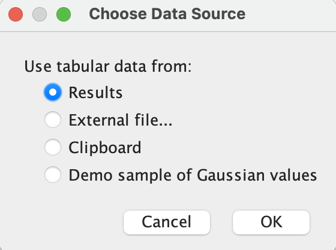
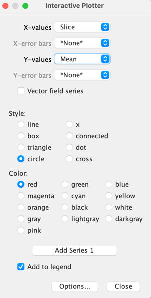

# 4章3節　輝度の経時的変化の測定　内容のアップデート

20210906 三浦

「ImageJではじめる生物画像解析」のp123からp124にかけて"Plot Results機能の追加"という項があり、"Plot_Results.bsh"というスクリプトをダウンロードしてインストールする旨を書いたが、このスクリプトは新しい機能が付け加わって"Interactive Plotting..."というプラグインになった。そこで、スクリプト"Plot_Results.bsh"単体のインストールと使用ではなく、BARプラグイン全体をインストールして使用する必要がある。BARは、アップデートサイトで追加し、Fijiを再起動する。

このことでメニューに新たに加わる"BAR"から、[BAR > Data Analysis > Interacitiv Plotting...]を選ぶことで、本文にあるPlot Resultsと同じような機能、すなわちResultsTableに表示された測定値のプロッティングを行うことができる。使い方は本文に書いてあるものと似ているが、データソースをResults Table以外にも選択することが可能になった（機能が追加された）ので、次のようなウィンドウがまず現れる。

ResultsTable以外にも、外部のファイル（CSVなど）や、クリップボードのデータをプロットする選択肢があるが、ここではResultsを選ぶ。

次に現れるウィンドウは、本文にあるものとよく似ており、操作に特に変更はない。ただし、Add Dataset1ではなく、Add Series1にボタンの名称が変更されているので、注意。

## 経緯

"Plot_Results.bsh"のスクリプトが使われていたのはv1.1.6までで（入手は可能：[リンク](https://zenodo.org/record/28838)）、v1.1.7では機能が追加され、"Plot_XY_Data.bsh"に名前が変更された。そののち、v.1.1.9ではインタラクティブな機能が強化されるとともにSciJavaを使った構成の大きな変化があり、スクリプトではなくJavaのプラグインになった。このため、スクリプトを単体でダウンロードして使うのではなく、プラグインをアップデートサイトで追加して"Interactive Plotting"を使用する。なお、BARの現状であるが、1.1.14をIJ1バージョンの最後とし、IJ2に移行した1.51（2017年）が最新である。